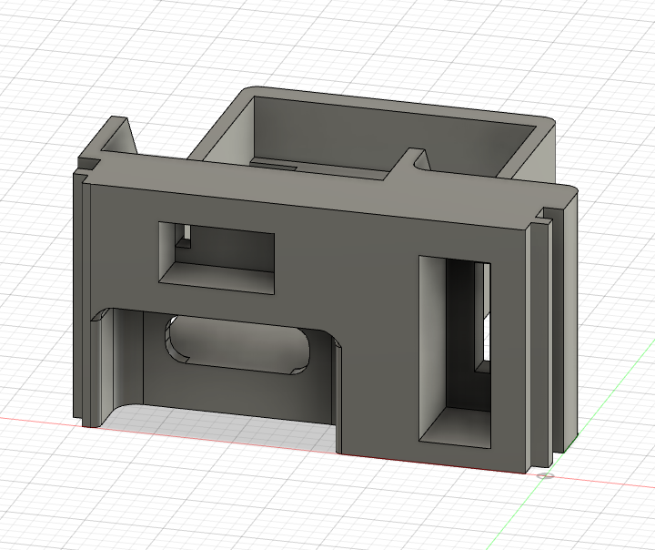

# nice!nano Dactyl Manuform holder



More to come later, I'm tired :sleeping:

This is designed for v1 of the nice!nano. If the v2's dimensions are the same, you'll be good to go. The width of the holder is the same as the popular [Elite-C holder out there](https://github.com/carbonfet/dactyl-manuform/blob/master/things/elite-c%20holder.STL), but it's 4mm taller. Be sure to update the opening in the SCAD model or whatever you're using.

This is what I change it to for the Dactl Manuform, but _please_ test this before you do a full print.
```diff
-(def usb-holder-space  (translate (map + usb-holder-position [-1.5 (* -1 wall-thickness) 2.9]) (cube 28.666 30 12.4)))
-(def usb-holder-notch  (translate (map + usb-holder-position [-1.5 (+ 4.4 notch-offset) 2.9]) (cube 31.366 1.3 12.4)))
+(def usb-holder-space  (translate (map + usb-holder-position [-1.5 (* -1 wall-thickness) 2.9]) (cube 28.666 30 23.4)))
+(def usb-holder-notch  (translate (map + usb-holder-position [-1.5 (+ 4.4 notch-offset) 2.9]) (cube 31.366 1.3 23.4)))
```

## Parts

- Reset switch: 6mm slim tactile switch ([Adafruit](https://www.adafruit.com/product/1489))
- Power switch: SPDT Slide Switch ([Adafruit](https://www.adafruit.com/product/805))

## Attribution

Many thanks to [@carbonfet's excellent holder](https://github.com/carbonfet/dactyl-manuform/blob/master/things/elite-c%20holder.STL) for Elite-C's and Pro Micro's, as that is what I referenced when modeling this.

